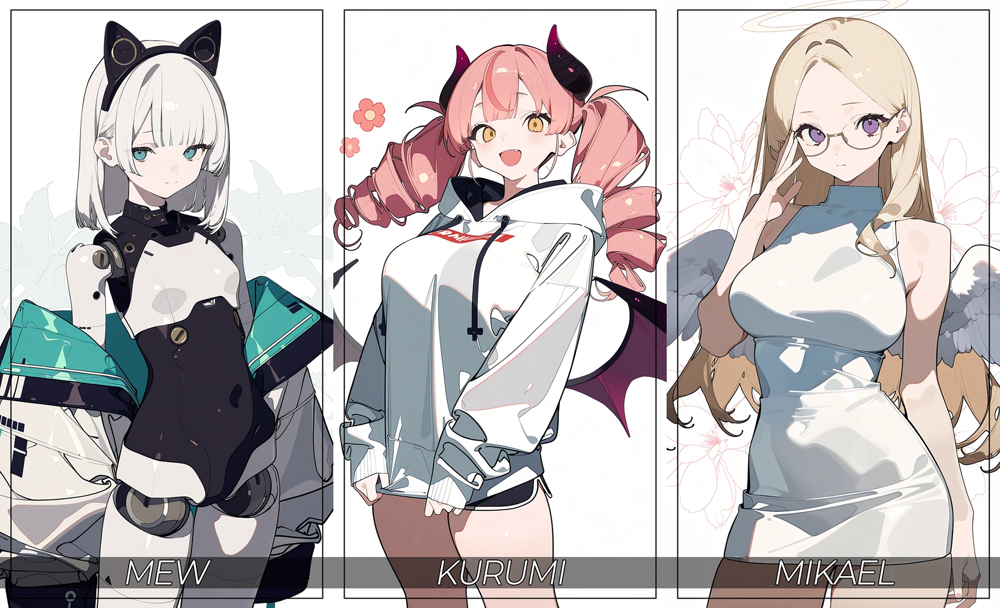

# Archive 03 (아카이브 03)

> 세 명의 인외(人外) 미소녀가 전하는 투자 인사이트

딱딱하고 어려운 투자 콘텐츠를 탈피. 천사, 악마, 안드로이드라는 세 명의 인외 미소녀 캐릭터가 최신 데이터를 바탕으로 전하는 대화 형식의 투자 정보 연재 블로그. 데이터/성장성/리스크를 대표하는 세 캐릭터의 티키타카를 보다 보면 어느새 당신도 경제 전문가.

## 주요 기능 (Key Features)

- **대시보드형 메인 페이지**: 최신글, 전체 글 목록, 태그 클라우드, 검색 기능을 한눈에 볼 수 있는 '콘텐츠 허브'
- **캐릭터 중심 콘텐츠**: 뮤(데이터), 쿠루미(성장성), 미카엘(리스크) 세 명의 AI 페르소나가 진행하는 토크형 아티클
- **반응형 디자인**: PC, 태블릿, 모바일 등 모든 디바이스에서 최적화된 레이아웃 제공
- **다크 모드**: 콘텐츠에 집중할 수 있는 세련된 다크 모드 인터페이스

## 사용 기술 (Tech Stack)

- 모든 콘텐츠는 **Google Gemini**를 포함한 LLM을 통해 생성 및 가공되었습니다.
- 모든 캐릭터 이미지는 AI를 통해 생성되었습니다.