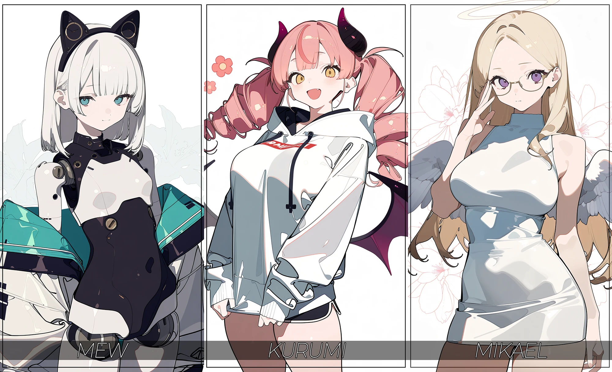

# Archive 03

> Financial Insights from 3 Non-human Girls

**Archive 03** is a blog that breaks away from dense and difficult investment content. It features conversational articles where three unique non-human characters—an angel, a devil, and an android—discuss investment topics based on the latest data. As you follow the engaging dialogue between characters representing data, growth, and risk, you'll find yourself becoming an economic expert.

---

## 🚀 Key Features

-   **Bilingual Support:** Seamlessly supports both Korean and English. The site structure is fully optimized for multilingual SEO, providing a native experience for each language group.
-   **Multiple Color Themes:** Offers three distinct color themes (Default Dark, Cosmic Indigo, Aetherial Light) that users can switch between instantly to suit their preference.
-   **Interactive Dashboard:** Serves as a "content hub" with an interactive dashboard featuring the latest post, a full article list with animated pagination, a dynamic tag cloud, and real-time search.
-   **Live Financial Charts:** Integrates professional-grade, real-time TradingView charts directly within articles, allowing for dynamic data visualization.
-   **Character-Driven Content:** Presents complex financial information through engaging talk-show-style articles led by three AI personas: Mew (Data), Kurumi (Growth), and Mikael (Risk).
-   **Blazing Fast & Lightweight:** Built with Hugo, a static site generator, ensuring unparalleled speed, performance, and security.

---

## 🛠️ Tech Stack

-   All content is generated and processed through LLMs, including **Google Gemini**.
-   All character images are generated by AI (Stable Diffusion).

---
 
 

# 아카이브 03

> 세 명의 인외(人外) 소녀가 전하는 투자 인사이트

딱딱하고 어려운 투자 콘텐츠를 탈피. 천사, 악마, 안드로이드라는 세 명의 인외 미소녀 캐릭터가 최신 데이터를 바탕으로 전하는 대화 형식의 투자 정보 연재 블로그. 데이터/성장성/리스크를 대표하는 세 캐릭터의 티키타카를 보다 보면 어느새 당신도 경제 전문가.

---

## 🚀 주요 기능

-   **완벽한 다국어 지원:** 한국어와 영어를 완벽하게 지원합니다. 다국어 SEO에 최적화된 URL 구조를 통해 각 언어권 사용자에게 최상의 네이티브 경험을 제공합니다.
-   **3가지 컬러 테마:** 사용자의 취향에 맞춰 즉시 변경할 수 있는 3가지 컬러 테마(기본 다크, 코스믹 인디고, 에테리얼 라이트)를 제공합니다.
-   **대화형 대시보드:** 최신글, 애니메이션 페이지네이션이 적용된 전체 글 목록, 동적 태그 클라우드, 실시간 검색 기능을 한눈에 볼 수 있는 '콘텐츠 허브'입니다.
-   **실시간 금융 차트:** TradingView 위젯을 통합하여, 게시물 내에서 종목에 따른 실시간 가격 차트를 동적으로 제공합니다.
-   **캐릭터 중심 콘텐츠:** 뮤(데이터), 쿠루미(성장성), 미카엘(리스크) 세 명의 AI 페르소나가 진행하는 토크형 아티클을 통해 복잡한 금융 정보를 흥미진진하게 전달합니다.
-   **초고속 경량 사이트:** 정적 사이트 생성기 Hugo를 기반으로 구축되어, 비교할 수 없는 속도, 성능, 그리고 보안성을 갖추었습니다.

---

## 🛠️ 사용 기술

-   모든 콘텐츠는 **Google Gemini**를 포함한 LLM을 통해 생성 및 가공되었습니다.
-   모든 캐릭터 이미지는 AI(스테이블 디퓨전)를 사용해 생성되었습니다.
